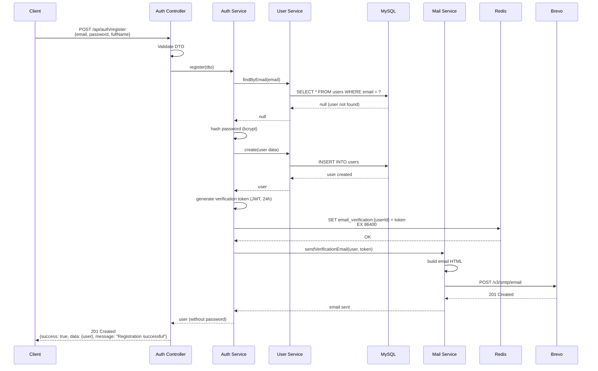
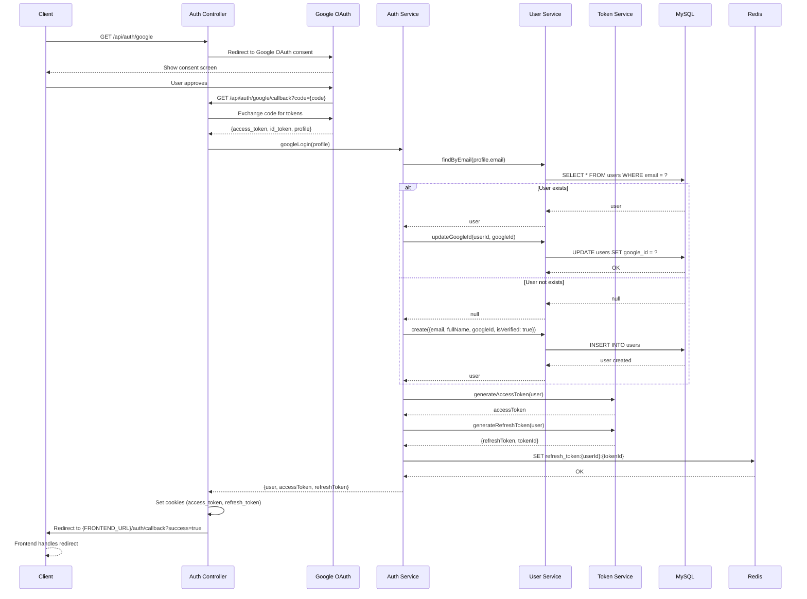
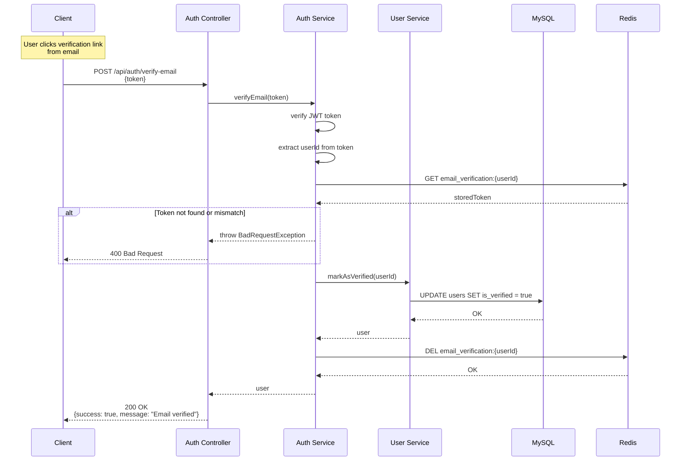
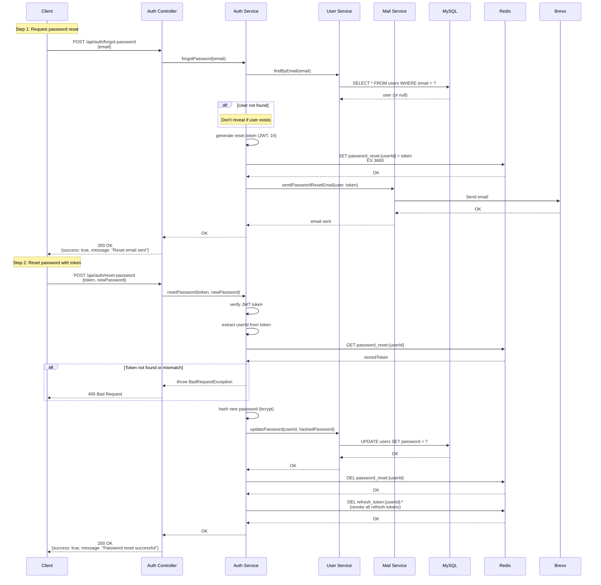

# Backend Foundation - Design Document

> **Feature:** Backend Foundation Setup
> **Type:** Infrastructure
> **Architecture:** Modular Monolith + Layered Architecture
> **Status:** Draft

---

## 1. OVERVIEW

### 1.1 Purpose

This design document specifies the architecture and implementation details for the Backend Foundation of the Smart Laptop Store platform. The backend will be built using NestJS following a Modular Monolith architecture with Layered Architecture per module, providing authentication, user management, and foundational infrastructure for the entire e-commerce system.

### 1.2 Design Goals

- **Security-First**: Implement HTTP-only cookie-based JWT authentication to prevent XSS attacks
- **Modular Architecture**: Clear module boundaries with well-defined interfaces
- **Production-Ready**: Include logging, monitoring, error handling, and validation from day one
- **Scalable Foundation**: Stateless authentication and Redis-based token management for horizontal scaling
- **Developer Experience**: Comprehensive Swagger documentation and consistent API patterns

### 1.3 Key Design Decisions

| Decision                         | Rationale                                                                                          |
| -------------------------------- | -------------------------------------------------------------------------------------------------- |
| **HTTP-only Cookies for Tokens** | Prevents XSS attacks by making tokens inaccessible to JavaScript. More secure than localStorage.   |
| **Refresh Token Rotation**       | Each refresh generates a new token and invalidates the old one, limiting token reuse attacks.      |
| **Redis for Token Storage**      | Fast, distributed storage for refresh tokens. Enables instant revocation and multi-device support. |
| **Layered Architecture**         | Clear separation of concerns: Presentation → Application → Domain → Infrastructure.                |
| **TypeORM with Migrations**      | Version-controlled database schema changes. Easy rollback and deployment.                          |
| **Brevo for Email**              | Reliable transactional email service with good deliverability rates.                               |
| **Bcrypt for Passwords**         | Industry-standard password hashing with configurable salt rounds.                                  |

### 1.4 Scope

**In Scope:**

- NestJS project setup with TypeScript
- Authentication Module (JWT, Refresh Token, Google OAuth, Email Verification)
- User Module (CRUD, Profile, Addresses)
- Mail Module (Brevo integration)
- Global infrastructure (Exception filters, Validation, Logging, Swagger)
- Database setup (MySQL + TypeORM + Migrations)
- Redis setup for caching and token management

**Out of Scope:**

- Product, Order, Payment, Inventory modules (future phases)
- BullMQ job queues (future phases)
- Socket.IO real-time features (future phases)
- Production deployment and CI/CD (Phase 6)

---

## 2. ARCHITECTURE

### 2.1 High-Level Architecture

```
┌─────────────────────────────────────────────────────────────────┐
│                    FRONTEND (Next.js)                            │
│  - Client App (port 3002)                                        │
│  - Admin App (port 3003)                                         │
└────────────────────────┬────────────────────────────────────────┘
                         │ HTTPS + Cookies
                         │ (access_token, refresh_token)
┌────────────────────────▼────────────────────────────────────────┐
│                    API GATEWAY LAYER                             │
│  ┌──────────────┐  ┌──────────────┐  ┌──────────────┐          │
│  │ CORS Config  │  │ Rate Limiter │  │   Helmet     │          │
│  │ (credentials)│  │  (Throttler) │  │  (Security)  │          │
│  └──────────────┘  └──────────────┘  └──────────────┘          │
└────────────────────────┬────────────────────────────────────────┘
                         │
┌────────────────────────▼────────────────────────────────────────┐
│                    GLOBAL MIDDLEWARE                             │
│  ┌──────────────┐  ┌──────────────┐  ┌──────────────┐          │
│  │  Auth Guard  │  │  Role Guard  │  │  Validation  │          │
│  │   (JWT)      │  │   (RBAC)     │  │    Pipe      │          │
│  └──────────────┘  └──────────────┘  └──────────────┘          │
│  ┌──────────────┐  ┌──────────────┐  ┌──────────────┐          │
│  │  Exception   │  │  Transform   │  │   Logging    │          │
│  │   Filter     │  │ Interceptor  │  │ Interceptor  │          │
│  └──────────────┘  └──────────────┘  └──────────────┘          │
└────────────────────────┬────────────────────────────────────────┘
                         │
┌────────────────────────▼────────────────────────────────────────┐
│                    BUSINESS MODULES                              │
│  ┌─────────────────────────────────────────────────────────┐    │
│  │  AUTH MODULE                                             │    │
│  │  - Register, Login, Logout, Refresh                      │    │
│  │  - Google OAuth, Email Verification                      │    │
│  │  - Password Reset                                        │    │
│  └─────────────────────────────────────────────────────────┘    │
│  ┌─────────────────────────────────────────────────────────┐    │
│  │  USER MODULE                                             │    │
│  │  - User CRUD, Profile Management                         │    │
│  │  - Address Management                                    │    │
│  │  - Role Management (Admin only)                          │    │
│  └─────────────────────────────────────────────────────────┘    │
│  ┌─────────────────────────────────────────────────────────┐    │
│  │  MAIL MODULE                                             │    │
│  │  - Email sending via Brevo                               │    │
│  │  - Email templates                                       │    │
│  └─────────────────────────────────────────────────────────┘    │
└────────────────────────┬────────────────────────────────────────┘
                         │
┌────────────────────────▼────────────────────────────────────────┐
│                    INFRASTRUCTURE LAYER                          │
│  ┌──────────────┐  ┌──────────────┐  ┌──────────────┐          │
│  │    MySQL     │  │    Redis     │  │   Brevo      │          │
│  │  (Database)  │  │   (Cache +   │  │   (Email)    │          │
│  │              │  │    Tokens)   │  │              │          │
│  └──────────────┘  └──────────────┘  └──────────────┘          │
└─────────────────────────────────────────────────────────────────┘
```

### 2.2 Layered Architecture Per Module

Each module follows a strict 4-layer architecture:

```
┌─────────────────────────────────────────────────────────────────┐
│                    MODULE STRUCTURE                              │
│                                                                  │
│  ┌────────────────────────────────────────────────────────┐     │
│  │  PRESENTATION LAYER                                     │     │
│  │  - Controllers (HTTP endpoints)                         │     │
│  │  - DTOs (Data Transfer Objects)                         │     │
│  │  - Input validation                                     │     │
│  │  - Swagger decorators                                   │     │
│  │                                                         │     │
│  │  Example: auth.controller.ts                            │     │
│  └──────────────────────┬──────────────────────────────────┘     │
│                         │ calls                                  │
│  ┌──────────────────────▼──────────────────────────────────┐     │
│  │  APPLICATION LAYER                                       │     │
│  │  - Services (business logic)                             │     │
│  │  - Use case orchestration                                │     │
│  │  - Transaction management                                │     │
│  │  - Event emission                                        │     │
│  │                                                         │     │
│  │  Example: auth.service.ts                                │     │
│  └──────────────────────┬──────────────────────────────────┘     │
│                         │ uses                                   │
│  ┌──────────────────────▼──────────────────────────────────┐     │
│  │  DOMAIN LAYER                                            │     │
│  │  - Entities (TypeORM)                                    │     │
│  │  - Enums (UserRole, OrderStatus)                         │     │
│  │  - Interfaces (contracts)                                │     │
│  │                                                         │     │
│  │  Example: user.entity.ts, user-role.enum.ts             │     │
│  └──────────────────────┬──────────────────────────────────┘     │
│                         │ persisted by                           │
│  ┌──────────────────────▼──────────────────────────────────┐     │
│  │  INFRASTRUCTURE LAYER                                    │     │
│  │  - Repositories (data access)                            │     │
│  │  - External service adapters                             │     │
│  │  - Redis clients                                         │     │
│  │                                                         │     │
│  │  Example: user.repository.ts, redis.service.ts          │     │
│  └─────────────────────────────────────────────────────────┘     │
│                                                                  │
│  RULES:                                                          │
│  ✅ Top-down calls only (Presentation → Application → Domain)    │
│  ✅ Controllers are thin (validation + service call + response)  │
│  ✅ Business logic lives in Services                             │
│  ✅ Entities define data shape only                              │
│  ❌ No cross-layer violations                                    │
│  ❌ No business logic in Controllers or Repositories             │
└─────────────────────────────────────────────────────────────────┘
```

### 2.3 Module Communication

```
┌─────────────────────────────────────────────────────────────────┐
│                    MODULE DEPENDENCIES                           │
│                                                                  │
│  ┌──────────────┐                                               │
│  │ Auth Module  │                                               │
│  └──────┬───────┘                                               │
│         │ imports UserService                                   │
│         ▼                                                        │
│  ┌──────────────┐                                               │
│  │ User Module  │                                               │
│  └──────┬───────┘                                               │
│         │ exports UserService                                   │
│         │                                                        │
│  ┌──────▼───────┐                                               │
│  │ Mail Module  │                                               │
│  └──────────────┘                                               │
│  (used by Auth for email verification)                          │
│                                                                  │
│  RULES:                                                          │
│  ✅ Modules communicate via exported Services                    │
│  ✅ Use NestJS Dependency Injection                              │
│  ❌ Never import Repositories or Entities from other modules     │
│  ❌ Never query another module's database tables directly        │
└─────────────────────────────────────────────────────────────────┘
```

---

## 3. COMPONENTS AND INTERFACES

### 3.1 Auth Module

#### 3.1.1 Components

**Controllers:**

- `AuthController`: Handles all authentication endpoints

**Services:**

- `AuthService`: Core authentication logic (register, login, logout, refresh)
- `TokenService`: JWT token generation and validation
- `GoogleOAuthService`: Google OAuth integration

**Strategies:**

- `JwtStrategy`: Validates JWT tokens from cookies
- `LocalStrategy`: Validates email/password for login
- `GoogleStrategy`: Handles Google OAuth flow

**Guards:**

- `JwtAuthGuard`: Protects routes requiring authentication
- `RolesGuard`: Protects routes requiring specific roles
- `PublicGuard`: Marks routes as public (skip auth)

**Decorators:**

- `@Public()`: Mark endpoint as public
- `@Roles(...roles)`: Require specific roles
- `@CurrentUser()`: Extract user from request

#### 3.1.2 Interfaces

```typescript
// Token Payload
interface JwtPayload {
  sub: number; // userId
  email: string;
  role: UserRole;
  iat: number; // issued at
  exp: number; // expiration
}

// Refresh Token Data (stored in Redis)
interface RefreshTokenData {
  userId: number;
  tokenId: string; // UUID
  createdAt: Date;
  expiresAt: Date;
  userAgent?: string;
  ipAddress?: string;
}

// Auth Response
interface AuthResponse {
  success: true;
  data: {
    user: UserDto;
  };
  message: string;
}

// Cookie Options
interface CookieOptions {
  httpOnly: boolean;
  secure: boolean;
  sameSite: "strict" | "lax" | "none";
  maxAge: number;
  path: string;
  domain?: string;
}
```

#### 3.1.3 API Endpoints

| Method | Endpoint                        | Auth     | Description               |
| ------ | ------------------------------- | -------- | ------------------------- |
| POST   | `/api/auth/register`            | Public   | Register new user         |
| POST   | `/api/auth/login`               | Public   | Login with email/password |
| POST   | `/api/auth/logout`              | Required | Logout and revoke tokens  |
| POST   | `/api/auth/refresh`             | Public   | Refresh access token      |
| GET    | `/api/auth/me`                  | Required | Get current user info     |
| GET    | `/api/auth/google`              | Public   | Initiate Google OAuth     |
| GET    | `/api/auth/google/callback`     | Public   | Google OAuth callback     |
| POST   | `/api/auth/verify-email`        | Public   | Verify email with token   |
| POST   | `/api/auth/resend-verification` | Public   | Resend verification email |
| POST   | `/api/auth/forgot-password`     | Public   | Request password reset    |
| POST   | `/api/auth/reset-password`      | Public   | Reset password with token |

### 3.2 User Module

#### 3.2.1 Components

**Controllers:**

- `UsersController`: User management endpoints
- `ProfileController`: User profile endpoints
- `AddressController`: Address management endpoints

**Services:**

- `UsersService`: User CRUD operations
- `ProfileService`: Profile management
- `AddressService`: Address management

#### 3.2.2 Interfaces

```typescript
// User DTO (response)
interface UserDto {
  id: number;
  email: string;
  role: UserRole;
  fullName: string;
  phone: string | null;
  avatar: string | null;
  isVerified: boolean;
  lastLoginAt: Date | null;
  createdAt: Date;
}

// Address DTO
interface AddressDto {
  id: number;
  userId: number;
  fullName: string;
  phone: string;
  province: string;
  district: string;
  ward: string;
  street: string;
  isDefault: boolean;
  createdAt: Date;
}

// Update Profile DTO
interface UpdateProfileDto {
  fullName?: string;
  phone?: string;
  avatar?: string;
}

// Change Password DTO
interface ChangePasswordDto {
  currentPassword: string;
  newPassword: string;
}
```

#### 3.2.3 API Endpoints

| Method | Endpoint                     | Auth     | Roles | Description                   |
| ------ | ---------------------------- | -------- | ----- | ----------------------------- |
| GET    | `/api/users`                 | Required | Admin | List all users (paginated)    |
| GET    | `/api/users/:id`             | Required | Admin | Get user by ID                |
| PATCH  | `/api/users/:id`             | Required | Admin | Update user role              |
| DELETE | `/api/users/:id`             | Required | Admin | Deactivate user (soft delete) |
| GET    | `/api/users/profile`         | Required | All   | Get own profile               |
| PATCH  | `/api/users/profile`         | Required | All   | Update own profile            |
| PATCH  | `/api/users/change-password` | Required | All   | Change password               |
| GET    | `/api/users/addresses`       | Required | All   | Get own addresses             |
| POST   | `/api/users/addresses`       | Required | All   | Add new address               |
| PATCH  | `/api/users/addresses/:id`   | Required | All   | Update address                |
| DELETE | `/api/users/addresses/:id`   | Required | All   | Delete address                |

### 3.3 Mail Module

#### 3.3.1 Components

**Services:**

- `MailService`: Email sending via Brevo API

**Templates:**

- `welcome.template.ts`: Welcome email
- `verification.template.ts`: Email verification
- `password-reset.template.ts`: Password reset
- `password-changed.template.ts`: Password changed notification

#### 3.3.2 Interfaces

```typescript
// Email Options
interface SendEmailOptions {
  to: string;
  subject: string;
  html: string;
  from?: string;
}

// Template Data
interface VerificationEmailData {
  userName: string;
  verificationLink: string;
}

interface PasswordResetEmailData {
  userName: string;
  resetLink: string;
}
```

### 3.4 Global Infrastructure

#### 3.4.1 Exception Filter

```typescript
@Catch()
export class GlobalExceptionFilter implements ExceptionFilter {
  catch(exception: unknown, host: ArgumentsHost) {
    const ctx = host.switchToHttp();
    const response = ctx.getResponse();
    const request = ctx.getRequest();

    const status =
      exception instanceof HttpException
        ? exception.getStatus()
        : HttpStatus.INTERNAL_SERVER_ERROR;

    const errorResponse = {
      success: false,
      error: {
        code: this.getErrorCode(exception),
        message: this.getErrorMessage(exception),
        details: this.getErrorDetails(exception),
      },
      timestamp: new Date().toISOString(),
      path: request.url,
    };

    response.status(status).json(errorResponse);
  }
}
```

#### 3.4.2 Transform Interceptor

```typescript
@Injectable()
export class TransformInterceptor implements NestInterceptor {
  intercept(context: ExecutionContext, next: CallHandler): Observable<any> {
    return next.handle().pipe(
      map((data) => ({
        success: true,
        data,
        timestamp: new Date().toISOString(),
      })),
    );
  }
}
```

#### 3.4.3 Validation Pipe

```typescript
new ValidationPipe({
  whitelist: true, // Strip unknown properties
  forbidNonWhitelisted: true, // Throw error on unknown properties
  transform: true, // Auto-transform to DTO types
  transformOptions: {
    enableImplicitConversion: true,
  },
});
```

---

## 4. DATA MODELS

### 4.1 Database Schema

```sql
-- Users Table
CREATE TABLE users (
  id INT PRIMARY KEY AUTO_INCREMENT,
  email VARCHAR(255) UNIQUE NOT NULL,
  password VARCHAR(255),  -- nullable for Google OAuth users
  role ENUM('customer', 'staff', 'technician', 'warehouse', 'admin') DEFAULT 'customer',
  full_name VARCHAR(100) NOT NULL,
  phone VARCHAR(20),
  avatar VARCHAR(500),
  is_verified BOOLEAN DEFAULT FALSE,
  google_id VARCHAR(255) UNIQUE,
  last_login_at TIMESTAMP,
  deleted_at TIMESTAMP,  -- soft delete
  created_at TIMESTAMP DEFAULT CURRENT_TIMESTAMP,
  updated_at TIMESTAMP DEFAULT CURRENT_TIMESTAMP ON UPDATE CURRENT_TIMESTAMP,

  INDEX idx_email (email),
  INDEX idx_google_id (google_id),
  INDEX idx_role (role),
  INDEX idx_deleted_at (deleted_at)
);

-- Addresses Table
CREATE TABLE addresses (
  id INT PRIMARY KEY AUTO_INCREMENT,
  user_id INT NOT NULL,
  full_name VARCHAR(100) NOT NULL,
  phone VARCHAR(20) NOT NULL,
  province VARCHAR(100) NOT NULL,
  district VARCHAR(100) NOT NULL,
  ward VARCHAR(100) NOT NULL,
  street VARCHAR(255) NOT NULL,
  is_default BOOLEAN DEFAULT FALSE,
  created_at TIMESTAMP DEFAULT CURRENT_TIMESTAMP,

  FOREIGN KEY (user_id) REFERENCES users(id) ON DELETE CASCADE,
  INDEX idx_user_id (user_id),
  INDEX idx_is_default (is_default)
);
```

### 4.2 TypeORM Entities

#### 4.2.1 User Entity

```typescript
@Entity("users")
export class User {
  @PrimaryGeneratedColumn()
  id: number;

  @Column({ unique: true, length: 255 })
  email: string;

  @Column({ nullable: true, length: 255 })
  password: string;

  @Column({
    type: "enum",
    enum: UserRole,
    default: UserRole.CUSTOMER,
  })
  role: UserRole;

  @Column({ name: "full_name", length: 100 })
  fullName: string;

  @Column({ nullable: true, length: 20 })
  phone: string;

  @Column({ nullable: true, length: 500 })
  avatar: string;

  @Column({ name: "is_verified", default: false })
  isVerified: boolean;

  @Column({ name: "google_id", unique: true, nullable: true, length: 255 })
  googleId: string;

  @Column({ name: "last_login_at", type: "timestamp", nullable: true })
  lastLoginAt: Date;

  @DeleteDateColumn({ name: "deleted_at" })
  deletedAt: Date;

  @CreateDateColumn({ name: "created_at" })
  createdAt: Date;

  @UpdateDateColumn({ name: "updated_at" })
  updatedAt: Date;

  @OneToMany(() => Address, (address) => address.user)
  addresses: Address[];
}
```

#### 4.2.2 Address Entity

```typescript
@Entity("addresses")
export class Address {
  @PrimaryGeneratedColumn()
  id: number;

  @Column({ name: "user_id" })
  userId: number;

  @Column({ name: "full_name", length: 100 })
  fullName: string;

  @Column({ length: 20 })
  phone: string;

  @Column({ length: 100 })
  province: string;

  @Column({ length: 100 })
  district: string;

  @Column({ length: 100 })
  ward: string;

  @Column({ length: 255 })
  street: string;

  @Column({ name: "is_default", default: false })
  isDefault: boolean;

  @CreateDateColumn({ name: "created_at" })
  createdAt: Date;

  @ManyToOne(() => User, (user) => user.addresses, { onDelete: "CASCADE" })
  @JoinColumn({ name: "user_id" })
  user: User;
}
```

#### 4.2.3 Enums

```typescript
export enum UserRole {
  CUSTOMER = "customer",
  STAFF = "staff",
  TECHNICIAN = "technician",
  WAREHOUSE = "warehouse",
  ADMIN = "admin",
}
```

### 4.3 Redis Data Structures

#### 4.3.1 Refresh Tokens

```
Key Pattern: refresh_token:{userId}:{tokenId}
Value: JSON string
TTL: 7 days (604800 seconds)

Example:
Key: refresh_token:123:a1b2c3d4-e5f6-7890-abcd-ef1234567890
Value: {
  "userId": 123,
  "tokenId": "a1b2c3d4-e5f6-7890-abcd-ef1234567890",
  "createdAt": "2026-05-01T10:00:00Z",
  "expiresAt": "2026-05-08T10:00:00Z",
  "userAgent": "Mozilla/5.0...",
  "ipAddress": "192.168.1.1"
}
```

#### 4.3.2 Email Verification Tokens

```
Key Pattern: email_verification:{userId}
Value: token (JWT string)
TTL: 24 hours (86400 seconds)
```

#### 4.3.3 Password Reset Tokens

```
Key Pattern: password_reset:{userId}
Value: token (JWT string)
TTL: 1 hour (3600 seconds)
```

### 4.4 Database Indexes

| Table     | Index          | Columns    | Purpose                            |
| --------- | -------------- | ---------- | ---------------------------------- |
| users     | idx_email      | email      | Fast user lookup by email (login)  |
| users     | idx_google_id  | google_id  | Fast OAuth user lookup             |
| users     | idx_role       | role       | Filter users by role (admin panel) |
| users     | idx_deleted_at | deleted_at | Exclude soft-deleted users         |
| addresses | idx_user_id    | user_id    | Fast address lookup by user        |
| addresses | idx_is_default | is_default | Find default address quickly       |

---

## 5. AUTHENTICATION FLOWS

### 5.1 Registration Flow



### 5.2 Login Flow (HTTP-only Cookies)

```mermaid
sequenceDiagram
    participant C as Client
    participant API as Auth Controller
    participant AS as Auth Service
    participant US as User Service
    participant TS as Token Service
    participant DB as MySQL
    participant Redis as Redis

    C->>API: POST /api/auth/login<br/>{email, password}
    API->>API: Validate DTO
    API->>AS: login(email, password)
    AS->>US: findByEmail(email)
    US->>DB: SELECT * FROM users WHERE email = ?<br/>AND deleted_at IS NULL
    DB-->>US: user
    US-->>AS: user
    AS->>AS: compare password (bcrypt)
    alt Password invalid
        AS-->>API: throw UnauthorizedException
        API-->>C: 401 Unauthorized
    end
    AS->>TS: generateAccessToken(user)
    TS->>TS: sign JWT (15 min expiry)
    TS-->>AS: accessToken
    AS->>TS: generateRefreshToken(user)
    TS->>TS: generate tokenId (UUID)
    TS->>TS: sign JWT (7 days expiry)
    TS-->>AS: {refreshToken, tokenId}
    AS->>Redis: SET refresh_token:{userId}:{tokenId}<br/>= {userId, tokenId, createdAt, expiresAt}<br/>EX 604800
    Redis-->>AS: OK
    AS->>US: updateLastLogin(userId)
    US->>DB: UPDATE users SET last_login_at = NOW()
    DB-->>US: OK
    US-->>AS: OK
    AS-->>API: {user, accessToken, refreshToken}
    API->>API: Set-Cookie: access_token={accessToken}<br/>HttpOnly; Secure; SameSite=Strict; Max-Age=900
    API->>API: Set-Cookie: refresh_token={refreshToken}<br/>HttpOnly; Secure; SameSite=Strict; Max-Age=604800
    API-->>C: 200 OK<br/>{success: true, data: {user}, message: "Login successful"}
    Note over C: Cookies are automatically stored<br/>and sent with subsequent requests
```

### 5.3 Refresh Token Flow

```mermaid
sequenceDiagram
    participant C as Client
    participant API as Auth Controller
    participant AS as Auth Service
    participant TS as Token Service
    participant Redis as Redis

    C->>API: POST /api/auth/refresh<br/>Cookie: refresh_token={oldToken}
    API->>API: Extract refresh_token from cookie
    API->>AS: refresh(oldToken)
    AS->>TS: verifyRefreshToken(oldToken)
    TS->>TS: verify JWT signature
    TS->>TS: check expiration
    TS-->>AS: {userId, tokenId}
    AS->>Redis: GET refresh_token:{userId}:{tokenId}
    Redis-->>AS: tokenData
    alt Token not found in Redis
        AS-->>API: throw UnauthorizedException
        API->>API: Clear cookies
        API-->>C: 401 Unauthorized
    end
    AS->>TS: generateAccessToken(user)
    TS-->>AS: newAccessToken
    AS->>TS: generateRefreshToken(user)
    TS-->>AS: {newRefreshToken, newTokenId}
    AS->>Redis: DEL refresh_token:{userId}:{tokenId}
    Redis-->>AS: OK
    AS->>Redis: SET refresh_token:{userId}:{newTokenId}<br/>= {userId, newTokenId, ...}<br/>EX 604800
    Redis-->>AS: OK
    AS-->>API: {newAccessToken, newRefreshToken}
    API->>API: Set-Cookie: access_token={newAccessToken}<br/>HttpOnly; Secure; SameSite=Strict; Max-Age=900
    API->>API: Set-Cookie: refresh_token={newRefreshToken}<br/>HttpOnly; Secure; SameSite=Strict; Max-Age=604800
    API-->>C: 200 OK<br/>{success: true, message: "Token refreshed"}
```

### 5.4 Logout Flow

```mermaid
sequenceDiagram
    participant C as Client
    participant API as Auth Controller
    participant AS as Auth Service
    participant TS as Token Service
    participant Redis as Redis

    C->>API: POST /api/auth/logout<br/>Cookie: access_token={token}<br/>Cookie: refresh_token={refreshToken}
    API->>API: Extract tokens from cookies
    API->>AS: logout(accessToken, refreshToken)
    AS->>TS: verifyAccessToken(accessToken)
    TS-->>AS: {userId}
    AS->>TS: verifyRefreshToken(refreshToken)
    TS-->>AS: {userId, tokenId}
    AS->>Redis: DEL refresh_token:{userId}:{tokenId}
    Redis-->>AS: OK
    AS-->>API: logout successful
    API->>API: Set-Cookie: access_token=<br/>HttpOnly; Secure; SameSite=Strict; Max-Age=0
    API->>API: Set-Cookie: refresh_token=<br/>HttpOnly; Secure; SameSite=Strict; Max-Age=0
    API-->>C: 200 OK<br/>{success: true, message: "Logout successful"}
```

### 5.5 Google OAuth Flow



### 5.6 Email Verification Flow



### 5.7 Password Reset Flow



---

## 6. ERROR HANDLING

### 6.1 Error Categories

| Category       | HTTP Status | Error Code Prefix | Example                             |
| -------------- | ----------- | ----------------- | ----------------------------------- |
| Authentication | 401         | AUTH_xxx          | AUTH_001: Invalid credentials       |
| Authorization  | 403         | AUTHZ_xxx         | AUTHZ_001: Insufficient permissions |
| Validation     | 400         | VAL_xxx           | VAL_001: Invalid email format       |
| Not Found      | 404         | NF_xxx            | NF_001: User not found              |
| Conflict       | 409         | CONF_xxx          | CONF_001: Email already exists      |
| Rate Limit     | 429         | RL_xxx            | RL_001: Too many requests           |
| Internal       | 500         | INT_xxx           | INT_001: Database connection failed |

### 6.2 Error Response Format

```typescript
{
  success: false,
  error: {
    code: string,        // e.g., "AUTH_001"
    message: string,     // Human-readable message
    details?: any        // Additional context (validation errors, etc.)
  },
  timestamp: string,     // ISO 8601 timestamp
  path: string          // Request path
}
```

### 6.3 Common Error Codes

```typescript
export enum ErrorCode {
  // Authentication (401)
  AUTH_001 = "AUTH_001", // Invalid credentials
  AUTH_002 = "AUTH_002", // Invalid token
  AUTH_003 = "AUTH_003", // Token expired
  AUTH_004 = "AUTH_004", // Token revoked
  AUTH_005 = "AUTH_005", // Account not verified
  AUTH_006 = "AUTH_006", // Account deactivated

  // Authorization (403)
  AUTHZ_001 = "AUTHZ_001", // Insufficient permissions
  AUTHZ_002 = "AUTHZ_002", // Cannot modify own role
  AUTHZ_003 = "AUTHZ_003", // Cannot access resource

  // Validation (400)
  VAL_001 = "VAL_001", // Invalid email format
  VAL_002 = "VAL_002", // Password too short
  VAL_003 = "VAL_003", // Invalid phone format
  VAL_004 = "VAL_004", // Missing required field

  // Conflict (409)
  CONF_001 = "CONF_001", // Email already exists
  CONF_002 = "CONF_002", // Cannot delete default address

  // Not Found (404)
  NF_001 = "NF_001", // User not found
  NF_002 = "NF_002", // Address not found

  // Rate Limit (429)
  RL_001 = "RL_001", // Too many login attempts
  RL_002 = "RL_002", // Too many verification emails

  // Internal (500)
  INT_001 = "INT_001", // Database error
  INT_002 = "INT_002", // Redis error
  INT_003 = "INT_003", // Email service error
}
```

### 6.4 Error Handling Strategy

**Global Exception Filter:**

- Catches all unhandled exceptions
- Logs errors with context (user, request, stack trace)
- Transforms exceptions to standard error response
- Masks sensitive information in production

**Validation Errors:**

- Automatically handled by ValidationPipe
- Returns 400 with detailed field errors
- Example:

```json
{
  "success": false,
  "error": {
    "code": "VAL_004",
    "message": "Validation failed",
    "details": [
      {
        "field": "email",
        "errors": ["email must be a valid email"]
      },
      {
        "field": "password",
        "errors": ["password must be at least 8 characters"]
      }
    ]
  },
  "timestamp": "2026-05-01T10:00:00Z",
  "path": "/api/auth/register"
}
```

**Database Errors:**

- Catch TypeORM errors
- Transform to user-friendly messages
- Log full error details for debugging
- Example: Duplicate key → "Email already exists"

**External Service Errors:**

- Retry logic for transient failures (Brevo, Redis)
- Graceful degradation (email sending failure doesn't block registration)
- Log errors for monitoring

**Security Considerations:**

- Don't reveal if email exists (forgot password, registration)
- Generic error messages for authentication failures
- Rate limiting on sensitive endpoints
- Log suspicious activities (multiple failed logins)

---

## 7. TESTING STRATEGY

### 7.1 Testing Approach

This feature is **NOT suitable for property-based testing** because:

1. **Infrastructure Focus**: Primarily configuration and setup (database, Redis, authentication)
2. **Side Effects**: Most operations involve database writes, cookie setting, email sending
3. **Deterministic Flows**: Authentication flows are state machines, not pure functions
4. **External Dependencies**: OAuth, email services are not suitable for PBT

**Testing Strategy:**

- **Unit Tests**: Test individual services with mocked dependencies
- **Integration Tests**: Test API endpoints with real database (test container)
- **E2E Tests**: Test complete user flows (register → verify → login → logout)

### 7.2 Unit Testing

**Target: Services (business logic)**

```typescript
describe("AuthService", () => {
  let service: AuthService;
  let userService: jest.Mocked<UserService>;
  let tokenService: jest.Mocked<TokenService>;
  let mailService: jest.Mocked<MailService>;
  let redis: jest.Mocked<Redis>;

  beforeEach(() => {
    // Setup mocks
  });

  describe("register", () => {
    it("should create user with hashed password", async () => {
      // Arrange
      const dto = {
        email: "test@example.com",
        password: "password123",
        fullName: "Test User",
      };
      userService.findByEmail.mockResolvedValue(null);
      userService.create.mockResolvedValue(mockUser);

      // Act
      const result = await service.register(dto);

      // Assert
      expect(userService.create).toHaveBeenCalledWith(
        expect.objectContaining({
          email: dto.email,
          password: expect.not.stringContaining("password123"), // hashed
        }),
      );
      expect(result.password).toBeUndefined(); // password not returned
    });

    it("should throw ConflictException if email exists", async () => {
      // Arrange
      userService.findByEmail.mockResolvedValue(mockUser);

      // Act & Assert
      await expect(service.register(dto)).rejects.toThrow(ConflictException);
    });

    it("should send verification email", async () => {
      // Arrange
      userService.findByEmail.mockResolvedValue(null);
      userService.create.mockResolvedValue(mockUser);

      // Act
      await service.register(dto);

      // Assert
      expect(mailService.sendVerificationEmail).toHaveBeenCalledWith(
        mockUser,
        expect.any(String),
      );
    });
  });

  describe("login", () => {
    it("should return tokens and user on valid credentials", async () => {
      // Test implementation
    });

    it("should throw UnauthorizedException on invalid password", async () => {
      // Test implementation
    });

    it("should throw UnauthorizedException if user is deleted", async () => {
      // Test implementation
    });

    it("should update last_login_at timestamp", async () => {
      // Test implementation
    });
  });

  describe("refresh", () => {
    it("should generate new tokens and rotate refresh token", async () => {
      // Test implementation
    });

    it("should throw UnauthorizedException if token not in Redis", async () => {
      // Test implementation
    });
  });

  describe("logout", () => {
    it("should delete refresh token from Redis", async () => {
      // Test implementation
    });
  });
});
```

**Coverage Target: > 80%**

### 7.3 Integration Testing

**Target: Controllers + Services + Database**

```typescript
describe("AuthController (Integration)", () => {
  let app: INestApplication;
  let dataSource: DataSource;

  beforeAll(async () => {
    // Setup test database (Testcontainers)
    // Setup test Redis
    // Create NestJS app
  });

  afterAll(async () => {
    // Cleanup
  });

  beforeEach(async () => {
    // Clear database
  });

  describe("POST /api/auth/register", () => {
    it("should register new user and return 201", async () => {
      const response = await request(app.getHttpServer())
        .post("/api/auth/register")
        .send({
          email: "test@example.com",
          password: "password123",
          fullName: "Test User",
        })
        .expect(201);

      expect(response.body).toMatchObject({
        success: true,
        data: {
          user: {
            email: "test@example.com",
            fullName: "Test User",
            role: "customer",
            isVerified: false,
          },
        },
      });

      // Verify user in database
      const user = await dataSource.getRepository(User).findOne({
        where: { email: "test@example.com" },
      });
      expect(user).toBeDefined();
      expect(user.password).not.toBe("password123"); // hashed
    });

    it("should return 409 if email already exists", async () => {
      // Create user first
      await createUser({ email: "test@example.com" });

      // Try to register again
      await request(app.getHttpServer())
        .post("/api/auth/register")
        .send({
          email: "test@example.com",
          password: "password123",
          fullName: "Test User",
        })
        .expect(409);
    });

    it("should return 400 on validation errors", async () => {
      const response = await request(app.getHttpServer())
        .post("/api/auth/register")
        .send({
          email: "invalid-email",
          password: "short",
        })
        .expect(400);

      expect(response.body.error.details).toHaveLength(3); // email, password, fullName
    });
  });

  describe("POST /api/auth/login", () => {
    it("should login and set HTTP-only cookies", async () => {
      // Create verified user
      const user = await createUser({
        email: "test@example.com",
        password: await bcrypt.hash("password123", 10),
      });

      const response = await request(app.getHttpServer())
        .post("/api/auth/login")
        .send({
          email: "test@example.com",
          password: "password123",
        })
        .expect(200);

      // Check response
      expect(response.body).toMatchObject({
        success: true,
        data: {
          user: {
            email: "test@example.com",
          },
        },
      });

      // Check cookies
      const cookies = response.headers["set-cookie"];
      expect(cookies).toBeDefined();
      expect(cookies.some((c) => c.startsWith("access_token="))).toBe(true);
      expect(cookies.some((c) => c.startsWith("refresh_token="))).toBe(true);
      expect(cookies.some((c) => c.includes("HttpOnly"))).toBe(true);
      expect(cookies.some((c) => c.includes("SameSite=Strict"))).toBe(true);
    });

    it("should return 401 on invalid credentials", async () => {
      await request(app.getHttpServer())
        .post("/api/auth/login")
        .send({
          email: "test@example.com",
          password: "wrongpassword",
        })
        .expect(401);
    });
  });

  describe("POST /api/auth/refresh", () => {
    it("should refresh tokens using cookie", async () => {
      // Login first to get refresh token
      const loginResponse = await request(app.getHttpServer())
        .post("/api/auth/login")
        .send({ email: "test@example.com", password: "password123" });

      const cookies = loginResponse.headers["set-cookie"];
      const refreshTokenCookie = cookies.find((c) =>
        c.startsWith("refresh_token="),
      );

      // Refresh
      const response = await request(app.getHttpServer())
        .post("/api/auth/refresh")
        .set("Cookie", refreshTokenCookie)
        .expect(200);

      // Check new cookies
      const newCookies = response.headers["set-cookie"];
      expect(newCookies.some((c) => c.startsWith("access_token="))).toBe(true);
      expect(newCookies.some((c) => c.startsWith("refresh_token="))).toBe(true);
    });
  });

  describe("POST /api/auth/logout", () => {
    it("should clear cookies and revoke token", async () => {
      // Login first
      const loginResponse = await request(app.getHttpServer())
        .post("/api/auth/login")
        .send({ email: "test@example.com", password: "password123" });

      const cookies = loginResponse.headers["set-cookie"];

      // Logout
      const response = await request(app.getHttpServer())
        .post("/api/auth/logout")
        .set("Cookie", cookies)
        .expect(200);

      // Check cookies are cleared
      const logoutCookies = response.headers["set-cookie"];
      expect(logoutCookies.some((c) => c.includes("Max-Age=0"))).toBe(true);
    });
  });
});
```

### 7.4 E2E Testing

**Target: Complete user journeys**

```typescript
describe("User Registration and Login Flow (E2E)", () => {
  it("should complete full registration and login flow", async () => {
    // 1. Register
    const registerResponse = await request(app.getHttpServer())
      .post("/api/auth/register")
      .send({
        email: "newuser@example.com",
        password: "SecurePass123",
        fullName: "New User",
      })
      .expect(201);

    const userId = registerResponse.body.data.user.id;

    // 2. Verify email
    const verificationToken = await getVerificationTokenFromRedis(userId);
    await request(app.getHttpServer())
      .post("/api/auth/verify-email")
      .send({ token: verificationToken })
      .expect(200);

    // 3. Login
    const loginResponse = await request(app.getHttpServer())
      .post("/api/auth/login")
      .send({
        email: "newuser@example.com",
        password: "SecurePass123",
      })
      .expect(200);

    const cookies = loginResponse.headers["set-cookie"];

    // 4. Access protected route
    await request(app.getHttpServer())
      .get("/api/auth/me")
      .set("Cookie", cookies)
      .expect(200);

    // 5. Logout
    await request(app.getHttpServer())
      .post("/api/auth/logout")
      .set("Cookie", cookies)
      .expect(200);

    // 6. Try to access protected route (should fail)
    await request(app.getHttpServer())
      .get("/api/auth/me")
      .set("Cookie", cookies)
      .expect(401);
  });
});
```

### 7.5 Test Coverage Requirements

| Layer       | Coverage Target | Focus                      |
| ----------- | --------------- | -------------------------- |
| Services    | > 80%           | Business logic, edge cases |
| Controllers | > 70%           | Request/response handling  |
| Guards      | > 90%           | Authorization logic        |
| Pipes       | > 90%           | Validation logic           |
| Overall     | > 75%           | All code                   |

### 7.6 Testing Tools

- **Jest**: Unit and integration testing framework
- **Supertest**: HTTP assertions for integration tests
- **Testcontainers**: Spin up MySQL and Redis for integration tests
- **@nestjs/testing**: NestJS testing utilities
- **faker-js**: Generate test data

---
